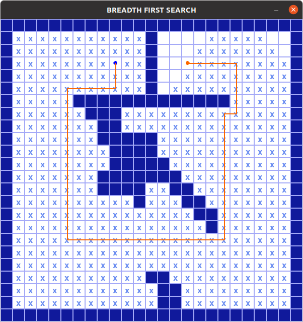
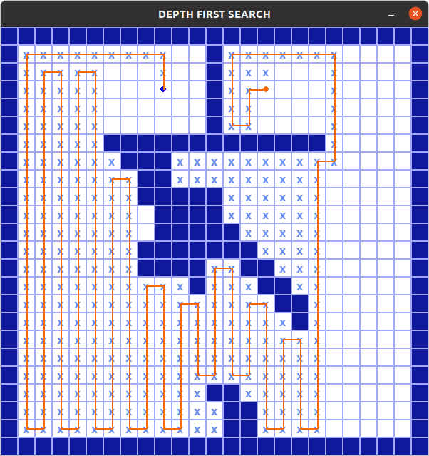
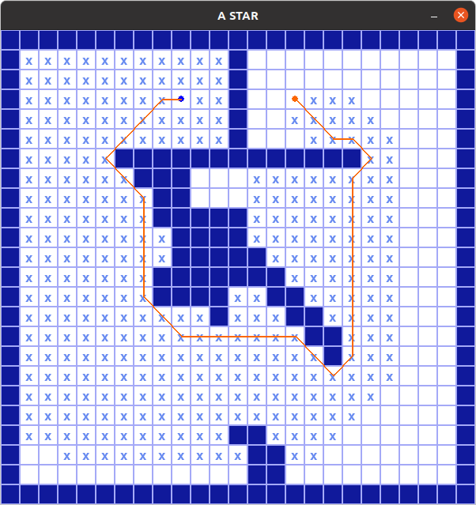

# DeterministicMethods

GitHub repository containing algorithms of deterministic methods for the course "Introduction to Robot Planning" from the Master's in Robotics and Automation at the University Carlos III de Madrid.

## Table of Contents

- [Installation](#installation)
- [Usage](#usage)
- [Results](#results)

## Installation

1. Clone the repository
2. Install pygame with: pip3 install pygame
3. You are ready to test the algorithms!

## Usage

1. Locate the python files with the algorithms under the [src](src/) folder.
2. Open the algorithm you want to test and make sure the relative path points to any of the .csv files under the map folders. Change the path if necessary.
3. Execute the python file with: python3 (algorithm_name).py. Make sure to change the relative path of the map in the code.

## Results

The three algorithms (Breadth First Search, Depth First Search and A*) have been tested in every map and the execution time of each algorithm has been recorded, excluding time for map visualization. The following bar graph shows the results obtained.

The DFS algorithm has the fastest performance when used in more complex maps, followed by the A* algorithm. The BFS algorithm was the slowest algorithm in most of the tested maps. However, the A* algorithm provides the shortest routes from the starting point to the goal for every map. The following image shows the results for the BFS, DFS and A* algorithms for a complex map.

